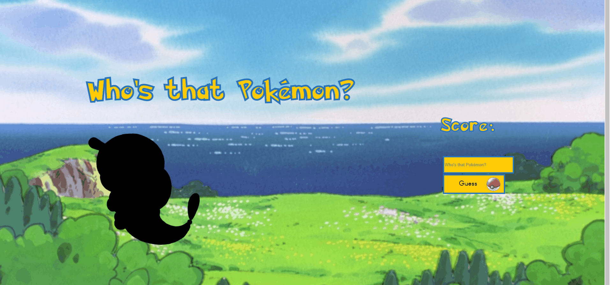

Who's that Pokémon?
-----------------

One of my favorite things about coding is finding ways to learn while also creating something my son will enjoy alongside me. He's been into Pokémon lately (and by into, I mean borderline obsessed), so as I was learning about APIs/AJAX, I came across the PokeAPI and realized: "I could do something really fun with this."

Lo and behold, "Who's that Pokémon?" was born.

No, it's not ✨oRiGiNaL✨, but that's not the point. This was a great exercise for me to learn new skills, including creating modals by way of vanilla JS and CSS instead of Bootstrap or jQuery. I also had to account for some interesting stuff with the data pulled from the API, like making sure the answer for a Nidoran (male) wouldn't be "nidoran-m."

Seriously, who would guess that?

Rules
------------------------------
Again, like Pokénect Four, the rules are simple. You get a silhouetted Pokémon, and it's your job to guess who it is. If you're not familiar with Pokémon, no worries! After an incorrect guess, you get thre different hints, one of them being a Pokédex number. If you guess successfully, you're rewarded with the image being revealed and a soundbite of the Pokémon's cry from the original games.

Generic Disclaimer
----------------
I don't own or have any association with Pokémon, nor did I compose any of the music or draw any of the artwork used here. Please don't sue me, Nintendo. I can't afford it.

Thank you
---------------------
Like last time, I have several people to thank: Phil, Jesse, Dane, Konnie, and several others for providing invaluable feedback in how to get this application to where it is now. There are still several things I'd like to implement down the road, such as more Pokémon, refactoring the API requests, etc. It's far from perfect, but I've learned a lot over the past month or two, and I'm excited I was able to make this. And guess what? My son loves it. He asks every day if we can play it. That's enough for me.

